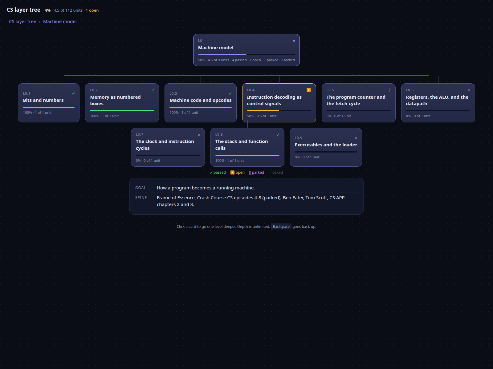

# cs-tree

A drill-down map of the layers of computer science, from machine code up to the big codebases.

Live page: https://typosbro.github.io/cs-tree/

Click any card and it becomes the root. Its children fan out below it. The breadcrumb walks back up. Depth is unlimited on purpose: the tree grows where you actually are.



## Run it

Open `explorer.html` in a browser. No server, no build step, no dependencies.

Or use the terminal view:

```
./cs-tree              dashboard: progress per layer, the open node, the parked ones
./cs-tree tree --all   every node
./cs-tree next         the one node to work on now
./cs-tree show L0.4    one node in full
./cs-tree pass L0.4    mark it passed; opens the next frontier node
./cs-tree open         open the explorer page
```

## What is in here

| File | What it is |
|---|---|
| `tree.json` | The source of truth. Every node lives here. |
| `explorer.html`, `explorer.js`, `progress.js` | The clickable page. |
| `tree-data.js` | Generated from `tree.json` so the page works from `file://`. |
| `tree.md` | The reading version, with a diagram of the ten layers. |
| `cs-tree` | The terminal view and editor. |
| `render.py` | Regenerates `tree.md` and `tree-data.js`. |

## The node format

```json
{
  "id": "L1.3",
  "name": "Pointers",
  "probe": "What does p+1 add for an int pointer versus a char pointer?",
  "source": "Beej's Guide to C, pointers",
  "status": "locked"
}
```

A layer adds a goal and a spine, and holds its nodes:

```json
{
  "id": "L1",
  "name": "C",
  "goal": "Talk to the machine in its own language.",
  "spine": "Beej's Guide to C, then CS:APP chapters 2 and 3.",
  "nodes": []
}
```

Ids are paths. `L2.5.3` is a child of `L2.5`. Depth is unlimited.

## Statuses

- passed: the probe was answered. Worth 1.
- open: the single node being worked now. Worth 0.5.
- parked: written down and deliberately not now. Worth 0.
- locked: the parent has not passed yet. Worth 0.

Only one node is ever open. The CLI enforces it: passing the open node opens the next frontier node automatically.

## The progress rule

Every leaf is one unit. A node with children is a container, and its percentage is its children rolled up by their unit counts. A node with five children and one learned reads 1 of 5, which is 20 percent. A container's own probe shows as a badge and does not add a unit.

The point of the rule is that the number never lies about how much is left, and it recomputes the moment a node sprouts children.

## Make your own

Fork it, replace `tree.json` with your own layers and probes, run `python3 render.py`, and open the page. The renderer needs nothing beyond Python 3.

## Knowledge is fractal

A tree is the data structure. Fractal is the property: every node renders the same shape as the whole thing, one node, its children, and a number. Zoom anywhere and the layout repeats. The page is a fractal viewer pointed at a tree.

This is not a coincidence of design. Knowledge really is self-similar. Every topic contains sub-topics, and those have their own prerequisites, tools, and traps, at every scale you care to look. You cannot bottom out. The coastline never stops being detailed.

So completeness is the wrong target. Resolution is the right one. You own a layer when the probe passes at the depth your question needs, not when the topic is exhausted. The probe on each node is the stopping rule.

## Why it is built this way

A big graph of everything at once is a menu, and menus are where learning dies. This shows you one node and its children, so you only ever see the next step and the shape immediately around it.

## License

MIT for the code. CC BY 4.0 for the tree content.
