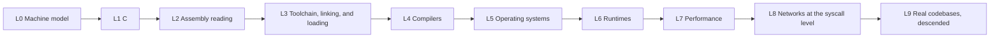

# CS layer tree

Own every layer of abstraction: given any program, descend any layer on demand with the right tool, and come back with an answer.

Method: Probe the node. On a miss, descend one ring. Teach from known material. Quiz. Write the row. The tree grows only at the frontier.

Nodes: 112. Passed 4, open 1, parked 1, locked 106.

Statuses:
- passed: Probed and answered correctly. Parent unlocks its children.
- open: The single node being worked right now.
- parked: Written down and deliberately not now. A decision, not a drift.
- locked: Parent has not passed yet.

The ten layers at a glance:

## Machine model (L0)

Goal: How a program becomes a running machine.

Spine: Frame of Essence, Crash Course CS episodes 4-8 (parked), Ben Eater, Tom Scott, CS:APP chapters 2 and 3.

Progress: 4 of 9 passed.

- **L0.1 Bits and numbers** [PASS] - probe: Convert -3 to 8-bit two's complement. Why is minus one all ones? - source: CS:APP ch2
- **L0.2 Memory as numbered boxes** [PASS] - probe: What is an address, and who decides the numbers? - source: Frame of Essence, How do computers read code?
- **L0.3 Machine code and opcodes** [PASS] - probe: What is an instruction made of, and where does the meaning live? - source: Frame of Essence, How do computers read code?
- **L0.4 Instruction decoding as control signals** [OPEN] - probe: How does a 4-bit opcode turn into one control wire, and what does that wire switch on? - source: Ben Eater, 8-bit CPU control logic part 1
- **L0.5 The program counter and the fetch cycle** [PARKED] - probe: Where is the address of the next instruction kept, and what can change it? - source: Tom Scott, The Fetch-Execute Cycle
- **L0.6 Registers, the ALU, and the datapath** [locked] - probe: Trace an add of two values from memory through registers and the ALU and back. - source: Ben Eater, ALU and registers episodes
- **L0.7 The clock and instruction cycles** [locked] - probe: Why does a CPU need a clock, and what happens on an edge? - source: Ben Eater, clock episodes
- **L0.8 The stack and function calls** [PASS] - probe: What exactly gets pushed on a call, and what does recursion exhaust? - source: Frame of Essence, How do computers read code?
- **L0.9 Executables and the loader** [locked] - probe: What turns a file on disk into a running process with an address space? - source: CS:APP ch7 and ch8

## C (L1)

Goal: Talk to the machine in its own language, with no runtime hiding the details.

Spine: Beej's Guide to C, then CS:APP chapters 2 and 3. Modern C by Gustedt as a reference.

Progress: 0 of 14 passed.

- **L1.1 The compilation model** [locked] - probe: Name the stages from source to executable and what each takes and produces. - source: Beej's Guide to C, intro
- **L1.2 Types, sizes, and representations** [locked] - probe: Why does a signed char overflow to a negative number, and what does unsigned buy? - source: CS:APP ch2
- **L1.3 Pointers** [locked] - probe: What does p+1 add for an int pointer versus a char pointer? - source: Beej's Guide to C, pointers
- **L1.4 Arrays and strings** [locked] - probe: Why does an array become a pointer in a function, and where does the length go? - source: Beej's Guide to C, arrays
- **L1.5 Structs, padding, and alignment** [locked] - probe: Why is the size of a struct with a char and an int not 5? - source: CS:APP ch3
- **L1.6 The memory regions of a process** [locked] - probe: Point at where locals, globals, string literals, and allocated data live. - source: CS:APP ch9
- **L1.7 Allocation and freedom** [locked] - probe: What does free actually do with the bytes, and why is use after free undefined? - source: Beej's Guide to C, manual memory
- **L1.8 Undefined behavior and the optimizer** [locked] - probe: Why can x plus one be less than x for signed int at -O2? - source: CS:APP ch3 and the C standard
- **L1.9 Function pointers** [locked] - probe: How does a callback work at the machine level? - source: Beej's Guide to C, function pointers
- **L1.10 System calls from C** [locked] - probe: What does write do that printf does not? - source: OSTEP ch2-4, The Linux Programming Interface
- **L1.11 Errors and errno** [locked] - probe: What does a syscall return on failure, and where does the reason live? - source: The Linux Programming Interface ch3
- **L1.12 Bit tricks and type punning** [locked] - probe: How do you read the four bytes of a float as an integer? - source: CS:APP ch2
- **L1.13 The preprocessor** [locked] - probe: A macro has no type checking. What breaks first? - source: Modern C ch9
- **L1.14 Headers, make, and libraries** [locked] - probe: Why does the compiler need a header while the linker needs a library? - source: CS:APP ch7

## Assembly reading (L2)

Goal: Read the machine's actual language and map it back to source.

Spine: CS:APP ch3, godbolt.org, gdb. Matt Godbolt's CppCon talk as the tour.

Progress: 0 of 11 passed.

- **L2.1 Registers of x86-64** [locked] - probe: Name the six argument registers and the return register. - source: CS:APP ch3
- **L2.2 The instruction vocabulary** [locked] - probe: What do mov, lea, cmp, test, jcc, call, and ret do? - source: CS:APP ch3
- **L2.3 Addressing modes** [locked] - probe: Decode a memory operand of base plus index times scale plus displacement. - source: CS:APP ch3
- **L2.4 The calling convention** [locked] - probe: Where does argument seven go, and where does the return value go? - source: CS:APP ch3
- **L2.5 Stack frames** [locked] - probe: Walk the frame pointer and stack pointer through a prologue and epilogue. How is the chain built? - source: CS:APP ch3
- **L2.6 Flags and conditional jumps** [locked] - probe: Which flag is for signed comparison, and which for unsigned? - source: CS:APP ch3
- **L2.7 Compiler Explorer practice** [locked] - probe: Switch -O0 to -O2 and explain every difference in the output. - source: godbolt.org
- **L2.8 Optimization levels** [locked] - probe: Why did your function disappear at -O2? - source: godbolt.org
- **L2.9 Disassembly tools** [locked] - probe: Find a function's address and bytes in objdump and again in gdb. - source: gdb and binutils docs
- **L2.10 Position-independent code and the PLT** [locked] - probe: Why does a call go to a stub instead of straight to the function? - source: CS:APP ch7
- **L2.11 ARM64 for contrast** [locked] - probe: How does ARM64 pass arguments and return values? - source: ARM Architecture Reference Manual, intro

## Toolchain, linking, and loading (L3)

Goal: Follow a compiled file from object code to a running process.

Spine: CS:APP ch7, Levine's Linkers and Loaders, Ian Lance Taylor's linker series.

Progress: 0 of 11 passed.

- **L3.1 Object files and sections** [locked] - probe: List the sections and what lives in each. - source: CS:APP ch7
- **L3.2 Symbols** [locked] - probe: What is the difference between a static function, a weak symbol, and an undefined one? - source: CS:APP ch7
- **L3.3 Relocations** [locked] - probe: Why does the compiler leave holes in the instruction stream? - source: Levine, Linkers and Loaders
- **L3.4 Static libraries** [locked] - probe: What is a dot a file, and why does link order matter? - source: CS:APP ch7
- **L3.5 Shared libraries** [locked] - probe: What is a soname, and why can upgrading one break a binary? - source: Levine, Linkers and Loaders
- **L3.6 The ELF format** [locked] - probe: Walk from the ELF header to the entry point. - source: ELF spec, man elf
- **L3.7 The loader** [locked] - probe: Who maps the segments, and where does the first instruction come from? - source: CS:APP ch7 and ch8
- **L3.8 Virtual address space, PIE, and ASLR** [locked] - probe: Why is main at a different address on every run? - source: CS:APP ch9
- **L3.9 Lazy binding at runtime** [locked] - probe: When is the GOT filled in, and what does LD_DEBUG show? - source: man ld.so, Levine
- **L3.10 Debug info** [locked] - probe: What does -g add to the file, and how does gdb use it? - source: DWARF intro, man gdb
- **L3.11 Sanitizers** [locked] - probe: How does AddressSanitizer know a pointer is stale? - source: ASan design docs

## Compilers (L4)

Goal: Turn text into machine code, and understand every step in between.

Spine: Crafting Interpreters, chibicc, the LLVM Kaleidoscope tutorial.

Progress: 0 of 11 passed.

- **L4.1 The pipeline** [locked] - probe: Name the stages and one artifact of each. - source: Crafting Interpreters ch1
- **L4.2 Lexing** [locked] - probe: Tokenize x equals a plus plus plus b and justify the choices. - source: Crafting Interpreters part 2
- **L4.3 Parsing** [locked] - probe: Parse an expression with precedence and associativity into a tree. - source: Crafting Interpreters part 2
- **L4.4 Semantic analysis** [locked] - probe: What is a symbol table, and when is it built? - source: Crafting Interpreters part 2
- **L4.5 IR and SSA** [locked] - probe: Translate a small if into three-address code, then into SSA. - source: Engineering a Compiler ch5
- **L4.6 Optimization passes** [locked] - probe: Explain constant folding, dead code elimination, inlining, and loop-invariant motion. - source: Engineering a Compiler ch8
- **L4.7 Instruction selection and register allocation** [locked] - probe: Why do compilers spill registers to the stack? - source: Engineering a Compiler ch11
- **L4.8 Dataflow analysis** [locked] - probe: What does liveness mean, and how is it computed? - source: Engineering a Compiler ch9
- **L4.9 LLVM** [locked] - probe: Read the IR for a small function and name the pass that transformed it. - source: LLVM Kaleidoscope tutorial
- **L4.10 Write a small compiler** [locked] - probe: Does your compiler turn recursive fib into working assembly? - source: chibicc, or Crafting Interpreters part 3
- **L4.11 Interpreters versus compilers** [locked] - probe: Why is an interpreter slower, and by roughly how much? - source: Crafting Interpreters part 3

## Operating systems (L5)

Goal: Understand the machine the program actually runs inside.

Spine: OSTEP, MIT 6.S081 with xv6, CS:APP chapters 8 and 9, The Linux Programming Interface.

Progress: 0 of 14 passed.

- **L5.1 Kernel mode and user mode** [locked] - probe: What can user code not do, and how does it ask? - source: OSTEP ch2-6
- **L5.2 System calls** [locked] - probe: Read strace output for ls and explain each line. - source: OSTEP ch4, man strace
- **L5.3 Processes** [locked] - probe: What exactly does fork return in each process, and why? - source: OSTEP ch5
- **L5.4 exec and the program image** [locked] - probe: What happens to the address space on exec? - source: OSTEP ch5
- **L5.5 Threads and scheduling** [locked] - probe: What is shared and what is private between threads? - source: OSTEP ch26-28
- **L5.6 Virtual memory and page tables** [locked] - probe: Walk a virtual address through a four-level table to a physical byte. - source: CS:APP ch9
- **L5.7 Page faults, demand paging, copy on write** [locked] - probe: Why does fork not copy memory immediately? - source: CS:APP ch9
- **L5.8 Files and file descriptors** [locked] - probe: What is a file descriptor really, and what does fork do to them? - source: OSTEP ch39
- **L5.9 File systems** [locked] - probe: Walk a path to an inode. What does fsync guarantee? - source: OSTEP ch40
- **L5.10 Interrupts and devices** [locked] - probe: How does the CPU learn that a key was pressed? - source: OSTEP ch36
- **L5.11 Synchronization** [locked] - probe: Build a mutex from an atomic. What is a futex? - source: OSTEP ch28-31
- **L5.12 Signals** [locked] - probe: Why is a signal handler allowed to do almost nothing? - source: man signal, Kerrisk ch20-22
- **L5.13 Namespaces, cgroups, containers** [locked] - probe: What makes a container not a virtual machine? - source: man namespaces, cgroups docs
- **L5.14 Build an OS** [locked] - probe: Make xv6 pass the first lab and explain the trap frame. - source: MIT 6.S081 labs

## Runtimes (L6)

Goal: See what the layer above C does on your behalf, and what it costs.

Spine: Crafting Interpreters, the V8 blog, CPython internals, the Garbage Collection Handbook.

Progress: 0 of 11 passed.

- **L6.1 Tree-walking interpreters** [locked] - probe: Where does the time go in a naive interpreter? - source: Crafting Interpreters part 2
- **L6.2 Bytecode virtual machines** [locked] - probe: Disassemble a Python function and explain the loop. - source: CPython dis module
- **L6.3 JIT and tiering** [locked] - probe: What does a baseline JIT buy over an interpreter? - source: V8 blog, Ignition and TurboFan
- **L6.4 Garbage collection** [locked] - probe: Compare mark and sweep, copying, and generational. - source: The Garbage Collection Handbook
- **L6.5 Object models** [locked] - probe: What are hidden classes, and why do they make property access fast? - source: V8 blog on shapes
- **L6.6 Inline caches and deoptimization** [locked] - probe: Why does megamorphic code slow down? - source: V8 blog on inline caches
- **L6.7 Event loops** [locked] - probe: What blocks the Node event loop, and why does it stall timers? - source: Node docs, the event loop
- **L6.8 CPython internals** [locked] - probe: Read the eval loop and explain one opcode end to end. - source: CPython Internals by Anthony Shaw
- **L6.9 V8 internals** [locked] - probe: Follow one JavaScript function from Ignition to TurboFan. - source: V8 blog, docs
- **L6.10 Foreign function boundaries** [locked] - probe: Why must a Python C extension manage reference counts by hand? - source: CPython C API docs
- **L6.11 The Go and Rust runtimes** [locked] - probe: What does the Go scheduler do that an OS thread does not? - source: Go runtime docs, Rust nomicon

## Performance (L7)

Goal: Reason about time and memory with numbers, not vibes.

Spine: CS:APP ch6, Brendan Gregg's Systems Performance, Agner Fog's manuals.

Progress: 0 of 12 passed.

- **L7.1 The memory hierarchy** [locked] - probe: Give rough latencies for register, L1, L2, L3, DRAM, disk, and network. - source: CS:APP ch6
- **L7.2 Cache lines and locality** [locked] - probe: Why can walking a matrix column first be ten times slower? - source: CS:APP ch6
- **L7.3 Cache-friendly layouts** [locked] - probe: Convert an array of structs to a struct of arrays and measure. - source: CS:APP ch6
- **L7.4 Branch prediction** [locked] - probe: Why does sorting an array make a branch faster? - source: Agner Fog, microarchitecture
- **L7.5 Pipelining and out-of-order execution** [locked] - probe: What is a pipeline stall, and what flushes a pipeline? - source: Computer Architecture, a Quantitative Approach
- **L7.6 Profiling with perf** [locked] - probe: Find the hottest function in a real program. - source: perf tutorial, Brendan Gregg
- **L7.7 Flamegraphs** [locked] - probe: Read a flamegraph and find the widest leaf. - source: Brendan Gregg, flamegraphs
- **L7.8 Memory profiling** [locked] - probe: Find a leak with valgrind or heaptrack. - source: valgrind docs
- **L7.9 Locks and contention** [locked] - probe: What is false sharing, and how do you see it? - source: Brendan Gregg, Systems Performance
- **L7.10 Atomics and memory models** [locked] - probe: Why is a relaxed atomic fine for a counter but wrong for a flag? - source: The C++ memory model, preshing.com
- **L7.11 Benchmarks that do not lie** [locked] - probe: Name three ways a benchmark lies. - source: Brendan Gregg, Systems Performance ch2
- **L7.12 SIMD and vectorization** [locked] - probe: Why did -O3 vectorize one loop and not the other? - source: Agner Fog, optimization manuals

## Networks at the syscall level (L8)

Goal: Follow a byte from your program to another machine and back.

Spine: Beej's Guide to Network Programming, High Performance Browser Networking, TCP/IP Illustrated.

Progress: 0 of 11 passed.

- **L8.1 Sockets** [locked] - probe: Write the minimal TCP client and server with syscalls only. - source: Beej's Guide to Network Programming
- **L8.2 TCP** [locked] - probe: Walk the handshake and explain what a retransmit does. - source: TCP/IP Illustrated vol 1
- **L8.3 Congestion control** [locked] - probe: What does the sender do on packet loss? - source: High Performance Browser Networking ch2
- **L8.4 DNS** [locked] - probe: Trace a lookup with dig and name the record types. - source: Computer Networking, a Top-Down Approach
- **L8.5 HTTP on the wire** [locked] - probe: What exactly is sent for one request and one response? - source: High Performance Browser Networking ch4
- **L8.6 HTTP/2 and HTTP/3** [locked] - probe: What problem does multiplexing solve, and why QUIC? - source: High Performance Browser Networking part 2
- **L8.7 TLS** [locked] - probe: What is verified in a handshake, and what does the session key protect? - source: Bulletproof SSL and TLS, intro
- **L8.8 epoll and event-driven servers** [locked] - probe: Why can one thread handle ten thousand connections? - source: man epoll, The Linux Programming Interface ch63
- **L8.9 Packet capture** [locked] - probe: Read a tcpdump of a failed connection and name the failing layer. - source: tcpdump and wireshark docs
- **L8.10 Proxies, NAT, load balancers** [locked] - probe: What address does the server see as the client? - source: Computer Networking, a Top-Down Approach
- **L8.11 How a packet reaches a container** [locked] - probe: Trace it through namespaces, the bridge, and NAT rules. - source: man namespaces, iptables docs

## Real codebases, descended (L9)

Goal: The endgame: take any large system and find your way down on demand.

Spine: Pro Git ch10, Chromium design docs, the SQLite file format, Designing Data-Intensive Applications.

Progress: 0 of 8 passed.

- **L9.1 Git internals** [locked] - probe: What is a commit object, and what does rebase rewrite? - source: Pro Git ch10
- **L9.2 SQLite and B-trees** [locked] - probe: How does the page layout make a lookup fast, and what does a write cost? - source: SQLite file format docs
- **L9.3 Redis** [locked] - probe: How does one thread serve so many clients? - source: Redis internals docs
- **L9.4 The Chrome process model** [locked] - probe: How many processes for two tabs, and where is the sandbox boundary? - source: Chromium design docs
- **L9.5 Blink and V8 at the boundary** [locked] - probe: Follow one JavaScript call into the DOM. - source: Chromium design docs, V8 embedder guide
- **L9.6 The Linux kernel** [locked] - probe: Follow a write syscall from entry to the disk queue. - source: Linux kernel source, LWN articles
- **L9.7 LLVM** [locked] - probe: Add a new pass and watch it run in the pipeline. - source: LLVM writing a pass docs
- **L9.8 Indexes and their cost** [locked] - probe: Why does an index make reads fast and writes slower? - source: Designing Data-Intensive Applications ch3
